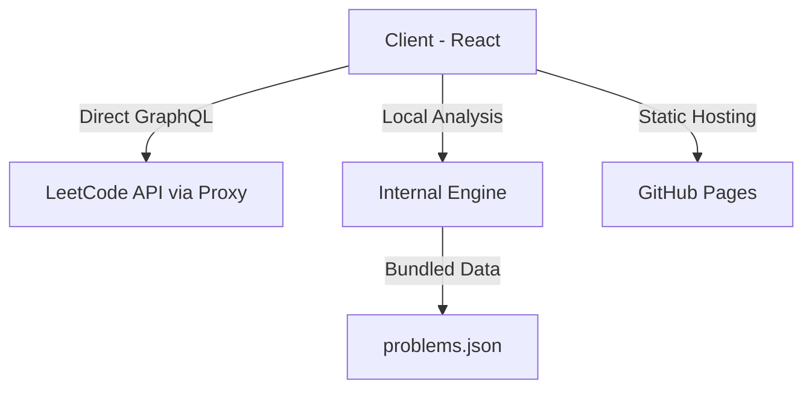

# LeetAI

[](https://opensource.org/licenses/MIT)
[](https://reactjs.org/)
[](https://www.typescriptlang.org/)
[](https://tailwindcss.com/)
[](https://expressjs.com/)
[](client/)
[](server/)

**LeetAI** helps you practice LeetCode problems more effectively. It looks at your public profile, finds topics where you need more practice, and suggests a list of problems to work on.

[Dashboard](#features) • [Installation](#installation) • [Deployment](#deployment) • [Architecture](#architecture)

## Features

- **Terminal-style UI**: A clean dashboard inspired by code editors and terminals.
- **Skill Gap Detection**: Finds topics you haven't solved many problems in (like Dynamic Programming or Graphs).
- **Practice Queue**: Suggests 8 unique problems based on your weakest topics.
- **Themes**: Switch between dark and light modes.
- **API Sync**: Gets your latest stats directly from LeetCode.
- **Progress Tracking**: Saves your completed recommendations locally.

## Tech Stack

### Frontend
- React 19 (Vite)
- Tailwind CSS v4
- Framer Motion
- Lucide React

### Backend
- Node.js & Express with TypeScript
- SQLite for storage
- LeetCode GraphQL API

## Installation

### Prerequisites
- Node.js (v18+)
- npm or yarn

### Quick Start
1. **Clone the repository:**
   ```bash
   git clone https://github.com/chuckabox/LeetAI.git
   cd leetai
   ```

2. **Launch the application:**
   If you are on Windows, you can use the provided startup script:
   ```powershell
   .\start.ps1
   ```
   *This will automatically install dependencies and start both the client (port 5173) and server (port 3001).*

### Manual Setup
**Backend:**
```bash
cd server
npm install
npm run dev
```

**Frontend:**
```bash
cd client
npm install
npm run dev
```

## Deployment
    
LeetAI is configured for easy deployment to **GitHub Pages**.

### Steps to Deploy:
1. **Push to GitHub**: Push your code to a GitHub repository.
2. **Enable Actions**: GitHub Actions will automatically build and deploy the app to the `gh-pages` branch.
3. **Configure Pages Settings**:
   - Go to your repository **Settings** > **Pages**.
   - Under **Build and deployment** > **Source**, select **GitHub Actions**.
4. **Standalone Mode**: The app now runs entirely in the browser using a CORS proxy and a pre-bundled problem database, making it 100% compatible with static hosting.

## Architecture

LeetAI now operates in a **Standalone Mode** for web deployment while maintaining a backend option for local development.



## License

This project is licensed under the MIT License - see the [LICENSE](LICENSE) file for details.

## Contributing

Pull requests are welcome. Feel free to open an issue if you find a bug.

## Troubleshooting

- **Server won't start**: Ensure no other process is using port 3001.
- **Client won't start**: Ensure no other process is using port 5173.
- **SQLite error**: Make sure you have write permissions in the `server` directory.
- **LeetCode Sync fails**: Check your internet connection and verify that the username is correct and public.
- **Reset Data**: If you need to reset all stored data, simply delete the `server/data.db` file and restart the server.

<p align="center">
  Built for the LeetCode community.
</p>
