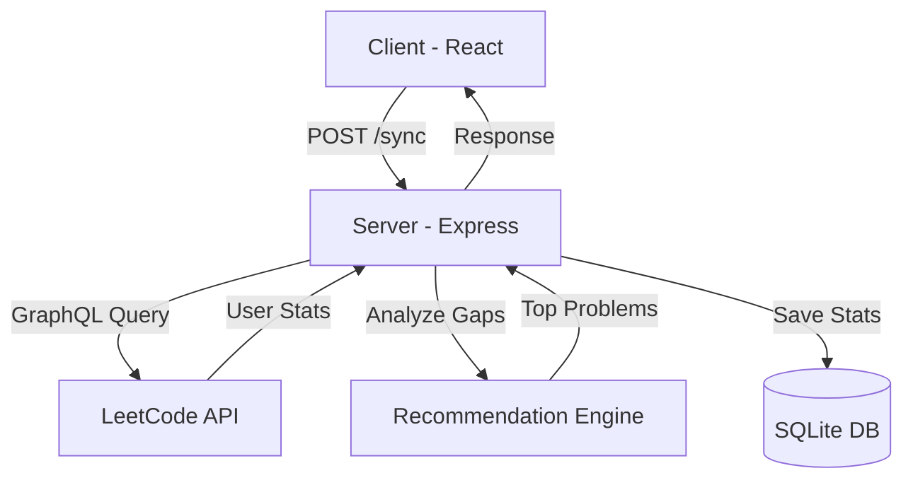

# LeetAI 🚀

[](https://opensource.org/licenses/MIT)
[](https://reactjs.org/)
[](https://www.typescriptlang.org/)
[](https://tailwindcss.com/)
[](https://expressjs.com/)

**LeetAI** is a high-performance, developer-centric practice recommendation engine for LeetCode. It analyzes your public profile to identify skill gaps and provides a curated queue of problems to help you master common interview patterns.

[Explore the Dashboard](#features) • [Installation](#installation) • [Architecture](#architecture)

---

## ✨ Features

- **Terminal-Industrial UI**: A minimalist, high-density dashboard inspired by modern IDEs and low-level system terminals.
- **Smart Skill Gap Detection**: Analyzes your solved counts across various categories (Dynamic Programming, Graphs, Trees, etc.) to pinpoint areas for improvement.
- **Curated Practice Queue**: Generates a personalized set of 8 unique problems tailored to your weakest topics.
- **Bi-Directional Themes**: Support for both `Terminal Dark` and `Matrix Light` modes with a single toggle.
- **Real-Time GraphQL Sync**: Connects directly to the LeetCode GraphQL API for instant profile analysis.
- **Progress Tracking**: Local persistence for marking recommendations as completed and tracking your daily cycles.

## 🛠️ Tech Stack

### Frontend
- **Framework**: React 19 (Vite)
- **Styling**: Tailwind CSS v4 (with PostCSS)
- **Animations**: Framer Motion
- **Icons**: Lucide React

### Backend
- **Runtime**: Node.js
- **Server**: Express with TypeScript
- **Database**: SQLite (better-sqlite3) for persistent user data
- **API**: LeetCode GraphQL API integration

---

## 🚀 Installation

### Prerequisites
- Node.js (v18+)
- npm or yarn

### Quick Start
1. Clone the repository:
   ```bash
   git clone https://github.com/chuckabox/LeetAI.git
   cd leetai
   ```

2. Run the startup script (Windows):
   ```powershell
   .\start.ps1
   ```
   *This will automatically install dependencies and launch both the client (port 5173) and server (port 3001).*

### Manual Setup
**Backend:**
```bash
cd server
npm install
npm run dev
```

**Frontend:**
```bash
cd client
npm install
npm run dev
```

---

## 🏗️ Architecture

LeetAI follows a modern monorepo-lite architecture:



## 📸 Screenshots

### Dashboard (Dark Mode)
> *Placeholder: Add your screenshot here*

### Dashboard (Light Mode)
> *Placeholder: Add your screenshot here*

---

## 📄 License

This project is licensed under the MIT License - see the [LICENSE](LICENSE) file for details.

## 🤝 Contributing

Contributions are welcome! Please feel free to submit a Pull Request.

---

<p align="center">
  Built with 🧡 for the LeetCode community.
</p>
